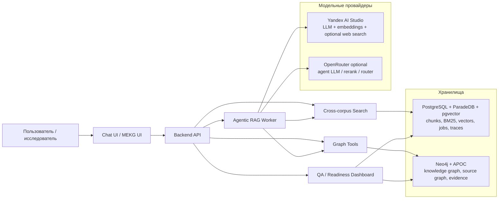
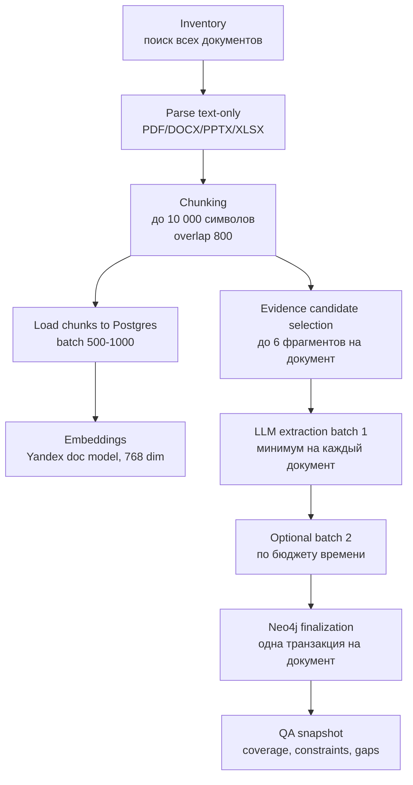
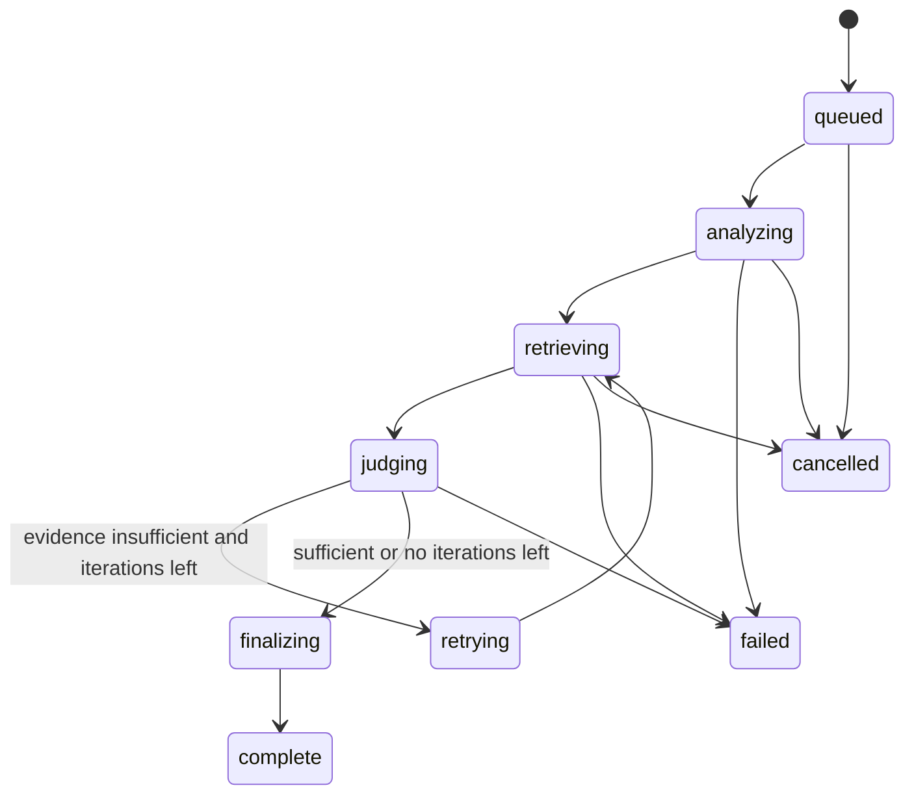

# Научный клубок: Knowledge Graph + Agentic RAG для R&D-документов

> Черновик презентации по архитектуре решения.
> Формат: один раздел = один слайд или группа слайдов.
> Цель: объяснить, зачем система нужна, как устроена внутри, что уже реализовано, как работает демо и почему ответы можно проверять.

---

## 1. Титульный слайд

**Научный клубок**
Единая карта знаний и исследовательский Agentic RAG для горно-металлургических R&D-документов.

**Ключевая идея:**
не просто искать похожие куски текста, а собирать проверяемые доказательства: документы, страницы, слайды, числовые параметры, технологические связи, противоречия и пробелы.

**Что показываем на демо:**

- загрузка и индексация рабочих документов;
- knowledge graph в Neo4j;
- vector/BM25-поиск в PostgreSQL/ParadeDB;
- agentic RAG-чат с trace, citations, confidence и режимами `full / partial / NO_*`;
- демо-вопросы по реальным обработанным документам.

---

## 2. Проблема: R&D-знания есть, но они “рассыпаны”

В R&D-среде данные обычно лежат не в одной аккуратной базе, а в наборе PDF, DOCX, PPTX, XLSX, отчетов, презентаций, статей, обзоров и протоколов.

Из-за этого возникают типичные проблемы:

- нельзя быстро понять, что уже исследовали;
- сложно найти числовые параметры с единицами измерения;
- одни и те же темы повторно изучаются разными командами;
- выводы из разных документов противоречат друг другу;
- экспертиза людей и лабораторий не связана с конкретными задачами;
- обычный чат с LLM может красиво ответить, но без проверяемой доказательной базы.

**Вывод для презентации:**
наша задача — не “прикрутить чат к файлам”, а построить исследовательскую систему, которая работает как инженер-аналитик: ищет, проверяет, сравнивает и честно говорит, где данных не хватает.

---

## 3. Почему обычного RAG недостаточно

Классический RAG часто работает так:

```text
вопрос → vector search → несколько chunk → LLM → ответ
```

Для научно-технических задач этого мало:

- похожий фрагмент может не содержать ответа;
- число без единицы измерения бесполезно;
- “оптимальный режим” нельзя утверждать без основания оптимальности;
- сравнение РФ и зарубежной практики невозможно без географии источника;
- “последние 5 лет” нельзя проверить без года;
- один chunk не показывает связи между материалом, процессом, оборудованием и результатом;
- LLM может смешать прямые факты и аналогии.

**Наша архитектура делает иначе:**

```text
вопрос
→ понять intent и обязательные слоты
→ составить план поиска
→ собрать evidence pack из разных tools
→ проверить достаточность
→ при нехватке сделать targeted retry
→ дать ответ или честный partial/no-data
```

---

## 4. Главный принцип решения

Финальный ответ разрешен только после проверки:

**“Есть ли достаточно доказательств, чтобы подтвердить каждый ключевой тезис?”**

Если нет — система не должна галлюцинировать. Она возвращает:

- `partial` — есть полезные данные, но не все слоты закрыты;
- `NO_DIRECT_DATA` — есть смежные данные, но нет прямого evidence;
- `NO_NUMERIC_DATA` — описание есть, но нужных чисел/единиц нет;
- `NO_EVIDENCE_FOUND` — релевантные источники не найдены;
- `OUT_OF_SCOPE` — вопрос требует данных вне корпуса/схемы.

Это превращает RAG из “генератора ответа” в **проверяемого исследовательского помощника**.

---

## 5. Общая архитектура системы



**Идея разделения:**

- PostgreSQL/ParadeDB — быстрый retrieval по текстам: dense vectors + настоящий BM25 + фильтры.
- Neo4j — структура знаний: документы, чанки, сущности, отношения, факты, источники.
- Agentic RAG — слой принятия решения: что искать, где искать, достаточно ли evidence.
- UI — главный пользовательский сценарий через исследовательский чат.

---

## 6. Компоненты Docker-стека

Система разворачивается изолированным Docker Compose-проектом.

Основные сервисы:

| Сервис | Назначение |
|---|---|
| `frontend` | React UI: чат, MEKG-панель, dashboard, graph view |
| `backend` | API, ingestion endpoints, search, graph tools, health, QA |
| `agent-worker` | фоновые agentic RAG jobs, trace, cancellation, resume |
| `neo4j` | граф знаний, APOC, source graph, evidence graph |
| `search-db` | PostgreSQL/ParadeDB: chunks, BM25, pgvector, jobs, cache |

Порты для демо:

- UI / Graph Builder: `localhost:8080`;
- Backend API: `localhost:8000`;
- Neo4j Browser: `localhost:7474`;
- Neo4j Bolt: `localhost:7687`;
- PostgreSQL/ParadeDB: `localhost:5433`.

Секреты хранятся только в `.env`, а в `.env.example` лежат placeholders.

---

## 7. Какие данные обрабатываем

Система рассчитана на рабочий корпус “Научный клубок”:

- внутренние технические отчеты;
- научные статьи;
- журнальные публикации;
- материалы конференций;
- обзоры;
- презентации;
- Word/PDF/PowerPoint/Excel-файлы с текстовым слоем;
- таблицы из Office-документов.

Поддерживаемые типы файлов:

- PDF;
- DOC / DOCX;
- PPTX;
- XLS / XLSX;
- TXT и похожие текстовые форматы.

В быстром режиме полной индексации намеренно отключены:

- OCR;
- VLM-анализ изображений;
- извлечение изображений;
- PDF `find_tables()`.

Причина: для цели “проиндексировать весь корпус за ограниченное время” мы используем уже существующий текстовый слой и нативные Office-таблицы.

---

## 8. Pipeline полной индексации



Pipeline сделан возобновляемым:

- стабильные `document_id`, `version_id`, `chunk_id`;
- таблицы `pipeline_runs` и `document_jobs`;
- состояния `discovered → parsed → chunks_loaded → first_extraction_done → neo4j_committed → complete`;
- lease через `FOR UPDATE SKIP LOCKED`;
- heartbeat;
- retry до трех попыток;
- restart/resume без дубликатов.

---

## 9. Почему два хранилища: Postgres и Neo4j

### PostgreSQL/ParadeDB

Используется для retrieval:

- хранит все текстовые chunks;
- хранит embeddings размерности 768;
- дает dense search через pgvector/HNSW;
- дает настоящий BM25 через `pg_search`;
- поддерживает фильтры по корпусу, году, языку, категории, numeric facts;
- хранит agent jobs, events, query cache.

### Neo4j

Используется для knowledge graph:

- документы и версии;
- source graph: chunks, таблицы, строки таблиц, страницы/слайды;
- извлеченные сущности: Material, Process, Equipment, Experiment, Expert, Property;
- отношения: `USES_MATERIAL`, `OPERATES_AT`, `PRODUCES`, `EVIDENCED_BY`, `CONTRADICTS`;
- graph traversal и graph evidence;
- QA связности и качества.

**Коротко:**
Postgres отвечает на “где похожие тексты?”, Neo4j отвечает на “как связаны факты?”.

---

## 10. Ontology / модель знаний

Базовые сущности:

- `Document`;
- `DocumentVersion`;
- `Chunk`;
- `Table`;
- `TableRow`;
- `Material`;
- `Process`;
- `Equipment`;
- `Property`;
- `Experiment`;
- `Publication`;
- `Expert`;
- `Facility`;
- `NumericFact`;
- `Finding`;
- `Gap`;
- `Contradiction`.

Типовые отношения:

- документ `HAS_VERSION`;
- версия `HAS_CHUNK`;
- факт `EVIDENCED_BY` chunk/table row;
- процесс `USES_MATERIAL`;
- процесс `OPERATES_AT` condition;
- эксперимент `MEASURED` property;
- технология `VALIDATED_BY` experiment/publication;
- эксперт `AUTHORED` publication или `EXPERT_IN` domain;
- claim `CONTRADICTS` claim.

**Главное:** каждый важный факт должен иметь привязку к источнику — документу, странице/слайду/chunk/table row.

---

## 11. Evidence-linked graph extraction

Извлечение графа строится не “из всего документа сразу”, а из выбранных evidence-фрагментов.

Для каждого документа:

- выбираются наиболее содержательные фрагменты;
- первый batch обязателен;
- второй batch выполняется при наличии времени/квоты;
- LLM возвращает structured JSON;
- при ошибке structured output выполняется JSON fallback;
- все связи и узлы документа пишутся в Neo4j одной транзакцией через `UNWIND`.

Это снижает:

- количество LLM-вызовов;
- стоимость;
- дублирование связей;
- риск частичной записи;
- время построения графа.

---

## 12. Embeddings: doc vs query

В Yandex AI Studio используются разные embedding-модели:

- document embeddings — для индексации chunk;
- query embeddings — для поискового запроса пользователя;
- размерность — 768.

Почему это важно:

- document model оптимизирована для хранения текстов;
- query model оптимизирована для поиска по запросу;
- смешивание моделей ухудшает retrieval;
- векторы новых chunks хранятся только в Postgres.

Если query embeddings недоступны, система не падает, а переходит в BM25-only fallback.

---

## 13. Cross-corpus search tool

`cross_corpus_search` — основной инструмент текстового поиска.

Он делает:

1. анализ запроса и выбор релевантных корпусов;
2. RU/EN rewrite и термины предметной области;
3. parallel dense search;
4. parallel BM25 search;
5. RRF-слияние результатов;
6. нормализацию между корпусами;
7. metadata/numeric boost;
8. diversity: ограничение результатов от одного документа/корпуса;
9. возврат evidence, diagnostics, coverage hints и candidate entity IDs.

Важно: tool сам не генерирует финальный ответ. Он возвращает доказательства для agentic RAG.

---

## 14. Graph tools

Graph tools работают поверх Neo4j:

- entity resolution;
- поиск технологий;
- поиск экспериментов;
- evidence packs;
- contradictions;
- gaps;
- experts/labs;
- source evidence search по Neo4j;
- graph neighborhood вокруг candidate entities.

Зачем нужен graph retrieval:

- находить не только похожий текст, но и связанные сущности;
- объяснять путь “материал → процесс → условие → результат”;
- проверять противоречия;
- находить экспертов и лаборатории;
- строить ответы на вопросы “что связано с чем?”.

---

## 15. Agentic RAG: state machine, а не свободный агент

Мы не даем LLM свободно “решать, что делать”.
LLM заполняет строгие JSON-контракты, а state machine управляет процессом.



Состояние хранит:

- parsed query;
- iteration;
- search history;
- evidence pack;
- contradictions;
- gaps;
- sufficiency;
- trace events;
- final result.

---

## 16. Query Analyzer

Analyzer превращает человеческий вопрос в структурированную задачу.

Он извлекает:

- intent;
- материалы;
- процессы;
- оборудование;
- параметры;
- ограничения;
- географию;
- временной диапазон;
- обязательные слоты;
- optional slots;
- признаки numeric/comparison/time/geography.

Пример:

> “Какие методы обессоливания воды подходят, если сульфаты, хлориды, Ca, Mg, Na по 200–300 мг/л, а сухой остаток должен быть ≤1000 мг/дм³?”

Обязательные слоты:

- метод;
- применимость;
- входные концентрации;
- выходное требование;
- единицы измерения;
- ограничения;
- источник.

---

## 17. Planner / Rewriter

Planner строит стратегию поиска на каждой итерации.

Итерация 1 — broad search:

- найти основные источники;
- найти документы/сущности/связи;
- получить первичный evidence.

Итерация 2 — missing-slot search:

- искать только то, чего не хватает;
- например: единицы, география, год, basis for optimality.

Итерация 3 — fallback / synonym search:

- RU/EN синонимы;
- терминологические варианты;
- смежные процессы;
- но drift guard не позволяет смежной аналогии подтвердить основной вывод.

---

## 18. Evidence Pack

Evidence Pack — это не просто список найденных chunk.

Каждый элемент evidence содержит:

- source type: local document / graph / web;
- document id и file name;
- page/slide/chunk/table row;
- quote/snippet;
- extracted facts;
- numeric values and units;
- matched slots;
- direct или analogy;
- confidence;
- candidate entity ids;
- warnings.

Evidence Pack нужен, чтобы финальный ответ был не “по памяти модели”, а по конкретным источникам.

---

## 19. Hard gates достаточности

Перед LLM Judge применяются жесткие правила.

| Ситуация | Gate |
|---|---|
| Нужен числовой ответ | число без единицы не закрывает numeric slot |
| Пользователь спрашивает “оптимальный” | нужен basis for optimality |
| Нужно сравнение РФ/зарубежье | нужны географические группы |
| Нужен период “последние 5 лет” | нужен год источника |
| Есть key claim | нужна citation |
| Источник metadata-only | не считается прямым evidence |
| Данные только аналогичные | не подтверждают основной вывод |
| Есть неразрешенное противоречие | full answer запрещен |

Порог:

- `80+` — можно full answer;
- `60–79` — partial answer;
- ниже — retry/no-data;
- hard gates имеют приоритет над score.

---

## 20. LLM Judge и Final Synthesis

Judge не отвечает на вопрос.
Он оценивает, достаточно ли evidence.

Judge возвращает:

- score;
- covered slots;
- missing slots;
- contradictions;
- next search focus;
- can answer partially;
- final mode.

Final Synthesis получает только Evidence Pack и verdict.

Финальный ответ содержит:

- краткий вывод;
- таблицу фактов/методов/экспериментов;
- citations;
- confidence;
- gaps;
- contradictions;
- предупреждения;
- режим ответа.

---

## 21. Web Search: внешний контур только по согласию

Yandex Web Search подключается адаптивно и только если пользователь явно разрешил внешний поиск.

По умолчанию web search выключен.

Причины:

- внешний web расходует квоты;
- данные уходят во внешний индекс;
- закрытые базы часто доступны только как metadata;
- нельзя отправлять внутренние chunks, file paths, internal ids или Evidence Pack.

Во внешний prompt уходят только очищенные rewrites.
Дополнительно поддерживается `WEB_REDACT_TERMS`.

Профили источников ограничены доменами:

- научные индексы;
- журналы;
- mining/metals;
- chemistry;
- patents;
- российские источники;
- свойства материалов;
- FAIR/materials data;
- preprints.

---

## 22. LLM provider strategy

Основная интеграция:

- Yandex AI Studio для Alice LLM;
- Yandex embeddings для document/query vectors;
- Yandex Web Search — опционально.

Дополнительный demo/provider mode:

- OpenRouter как LLM для agentic RAG router/reranker/synthesis;
- reasoning включается только внутри вызова;
- reasoning details не сохраняются и не показываются;
- structured JSON валидируется схемой;
- при сбое выполняется один repair-вызов.

Важно: extraction и embeddings остаются на Yandex; OpenRouter нужен как дополнительный LLM-провайдер для agentic слоя.

---

## 23. Degraded mode

Система должна быть полезной даже при сбое LLM/embeddings.

Если Yandex query embeddings недоступны:

- dense retrieval отключается;
- BM25 продолжает работать;
- graph tools продолжают работать;
- agent не падает.

Если LLM недоступна:

- deterministic analyzer;
- статические RU/EN rewrites;
- BM25 + graph retrieval;
- rule-based judge;
- шаблонный partial/no-data;
- full answer без подтвержденного evidence не генерируется.

Это важно для демо: система не “умирает”, а честно снижает режим ответа.

---

## 24. Пользовательский UX

Главный UX — не техпанель, а исследовательский чат.

В чате показываем:

- вопрос пользователя;
- live trace трех итераций;
- найденные источники;
- evidence cards;
- citations;
- confidence;
- gaps;
- contradictions;
- warnings;
- режим ответа.

Дополнительные настройки рядом с чатом:

- checkbox “Разрешить внешний Web Search”;
- выбор web profiles, максимум 2;
- фильтр по корпусу;
- фильтр по географии;
- фильтр по году;
- numeric mode;
- быстрые примеры из постановки.

MEKG-панель остается advanced/admin экраном.

---

## 25. Evidence cards в UI

Карточки evidence должны быстро отвечать на вопрос: “почему системе можно верить?”

Для локального источника:

- файл;
- корпус;
- страница/слайд/chunk id;
- quote;
- extracted numeric facts;
- confidence.

Для graph evidence:

- сущность;
- relation/path;
- validation status;
- linked source.

Для web evidence:

- URL;
- домен;
- annotation/citation;
- metadata-only marker.

Если есть candidate entity ids, можно открыть “показать в графе”.

---

## 26. Readiness dashboard

Dashboard нужен для демонстрации зрелости системы, не только красивого ответа.

Показываем:

- количество документов;
- количество chunks;
- сколько chunks embedded;
- сколько документов committed в Neo4j;
- покрытие по пяти корпусам;
- top processes;
- top materials;
- top equipment;
- experts/labs;
- contradictions;
- gaps;
- QA status;
- дата последнего QA snapshot.

Для демо можно отдельно показывать текущий срез:

- документы в Neo4j;
- документы с evidence-фактами;
- демо-набор 25 документов / 50 вопросов;
- QA PASS;
- SHACL violations = 0.

---

## 27. Demo questions

Для проверки сделан воспроизводимый demo-набор:

- 25 документов;
- 5 документов из каждого корпуса;
- 2 вопроса на документ;
- всего 50 вопросов;
- для каждого вопроса есть эталон;
- обязательные факты;
- числа и единицы;
- page/slide/chunk;
- допустимый answer mode;
- запрет на неподтвержденные claims.

Это позволяет показать не “один заранее подобранный вопрос”, а системную проверку.

Файл: `questions.md`.
Машиночитаемый набор: `backend/pilot/demo_questions.json`.

---

## 28. Типы вопросов для демо

Покрываем постановочные сценарии:

1. Методы и применимость:
   - какие методы подходят;
   - при каких условиях;
   - какие ограничения.

2. Числовой optimum:
   - скорость;
   - температура;
   - концентрация;
   - recovery;
   - единицы и basis for optimality.

3. Последние годы:
   - статьи/эксперименты за период;
   - обязательная проверка года.

4. РФ vs зарубежье:
   - география;
   - тип практики;
   - сравнение подходов.

5. Gaps/contradictions:
   - что не изучено;
   - где источники расходятся;
   - какие данные нужны для решения.

---

## 29. Пример демо-сценария 1: Cuprion

Вопрос:

> Какие извлечения Co, Ni, Cu и Mn заявлены для процесса Cuprion при переработке кобальт-марганцевых корок и на каких операциях основана схема?

Что система должна найти:

- Co — 91%;
- Ni — 85%;
- Cu — 61%;
- Mn — 60%;
- аммиачное выщелачивание;
- осаждение Mn/Co;
- экстракция и электроэкстракция Ni/Cu;
- citation на конкретный слайд/chunk.

Что нельзя утверждать:

- промышленное внедрение, если оно не подтверждено источником;
- экономику процесса, если ее нет в evidence.

---

## 30. Пример демо-сценария 2: обессоливание воды

Вопрос:

> Какие методы обессоливания подходят для воды с сульфатами, хлоридами, Ca, Mg, Na по 200–300 мг/л и требованием сухого остатка ≤1000 мг/дм³?

Почему это хороший вопрос:

- много параметров;
- нужны единицы измерения;
- нужно проверить применимость метода;
- нельзя просто назвать “обратный осмос” без условий;
- ответ должен различать факт, рекомендацию и gap.

Ожидаемый формат:

- таблица методов;
- входные ограничения;
- результат/качество воды;
- источники;
- gaps, если нет прямой валидации для всех условий.

---

## 31. Пример демо-сценария 3: циркуляция католита

Вопрос:

> Какие технические решения организации циркуляции католита при электроэкстракции никеля описаны в мировой практике, и какая скорость потока считается оптимальной?

Hard gates:

- если есть решения, но нет скорости — это `NO_NUMERIC_DATA` или partial;
- если есть скорость без единицы — full answer запрещен;
- если скорость из смежного процесса — это analogy, не direct evidence;
- если нет basis for optimality — нельзя писать “оптимальная”, только “указанная в источнике”.

Этот вопрос хорошо показывает, что система не должна додумывать недостающий числовой параметр.

---

## 32. Пример демо-сценария 4: Au/Ag/МПГ за последние 5 лет

Вопрос:

> Покажите эксперименты и публикации по распределению Au, Ag и МПГ между медным/никелевым штейном и шлаком за последние 5 лет.

Что проверяем:

- extraction of entities: Au, Ag, PGM;
- process/material relation;
- year filter;
- experiment/publication separation;
- citations;
- отсутствие источников вне периода.

Если у документа нет года, его нельзя уверенно включать в “последние 5 лет”.

---

## 33. Пример демо-сценария 5: gaps/contradictions

Вопрос:

> Где в корпусе есть пробелы или противоречия по технологическим решениям для шахтных вод в России и за рубежом?

Почему это важно:

- система должна уметь не только отвечать, но и показывать неизвестное;
- gaps — это ценный R&D-результат;
- contradiction — это сигнал для эксперта проверить источники;
- graph traversal помогает найти отсутствующие связи.

Финальный ответ должен явно разделять:

- подтвержденные факты;
- противоречия;
- пробелы;
- ближайшие релевантные источники;
- рекомендации для дальнейшего поиска.

---

## 34. QA и проверка качества

Уровни проверки:

1. Unit tests:
   - routing;
   - RRF;
   - diversity;
   - hard gates;
   - numeric normalization;
   - web domain limits;
   - BM25 fallback;
   - OpenRouter structured output mocks.

2. Integration tests:
   - Postgres jobs/events;
   - SSE reconnect;
   - cancellation;
   - restart/resume;
   - Neo4j rollback;
   - graph tools.

3. Data QA:
   - нет дубликатов документов/chunks/relations;
   - каждый evidence fact имеет источник;
   - QA snapshot;
   - SHACL/ontology constraints.

4. Demo evaluation:
   - 50 вопросов;
   - эталоны;
   - фактические ответы;
   - PASS/PARTIAL/FAIL.

---

## 35. Security и приватность

Ключевые принципы:

- API-ключи не хранятся в коде;
- секреты только в ignored `.env`;
- `.env.example` содержит только placeholders;
- raw LLM/web responses не пишутся в логи;
- reasoning details OpenRouter не сохраняются;
- во внешний web search не уходят local paths, chunks, internal IDs, Evidence Pack;
- внешний web выключен по умолчанию;
- web включается только по явному согласию пользователя.

Для промышленной версии дополнительно нужны:

- RBAC;
- аудит действий;
- разграничение доступа к внутренним документам;
- политики ФЗ-152/ИБ;
- управление жизненным циклом секретов.

---

## 36. Почему это лучше простого поиска

| Возможность | Обычный поиск | Наш подход |
|---|---:|---:|
| Найти похожий текст | да | да |
| Найти числовые факты с единицами | частично | да |
| Проверить источник каждого тезиса | редко | да |
| Показать связи материал-процесс-результат | нет | да |
| Найти противоречия | нет | да |
| Найти пробелы знаний | нет | да |
| Работать с RU/EN терминами | частично | да |
| Не отвечать при нехватке данных | редко | да |
| Возобновлять большой ingestion | нет | да |

---

## 37. Что уже сделано в текущей реализации

Реализовано:

- изолированный Docker Compose стек;
- Neo4j 2026.05 + APOC;
- PostgreSQL/ParadeDB + pgvector + BM25;
- Yandex AI Studio integration;
- Yandex document/query embeddings;
- fast-full ingestion pipeline;
- checkpoint/resume;
- partial Neo4j finalizer;
- cross-corpus search;
- graph tools;
- agentic RAG jobs/events/cancel;
- web search profiles, выключены по умолчанию;
- OpenRouter provider для agentic слоя;
- MEKG UI и chat integration;
- readiness/QA dashboard;
- demo questions set;
- tests and evaluation runners.

---

## 38. Что важно честно сказать на демо

Система уже показывает архитектурно правильный путь, но есть внешние зависимости:

- качество full LLM/web режима зависит от прав и квот Yandex/OpenRouter;
- если LLM-провайдер возвращает 403/429, система переходит в degraded mode;
- часть документов может иметь поврежденный текстовый слой;
- OCR/VLM отключены в fast-full режиме ради скорости;
- web search не заменяет лицензированные коннекторы Scopus/Web of Science/SciFinder;
- metadata-only источники не считаются прямым evidence.

Это не слабость, а важная engineering-позиция: лучше честный partial/no-data, чем красивый неподтвержденный ответ.

---

## 39. Roadmap после демо

Ближайшие улучшения:

- полноценный live evaluation всех 50 вопросов с валидными LLM-ключами;
- расширение ontology под конкретные R&D-направления;
- экспертная ручная правка графа;
- полноценные licensed connectors для закрытых источников;
- OCR/VLM pipeline как отдельный медленный режим;
- enterprise RBAC и аудит;
- export Markdown/PDF/JSON-LD;
- уведомления о новых публикациях/патентах;
- graph-based recommendation для новых экспериментов.

---

## 40. Финальный слайд: ценность решения

**Научный клубок** превращает разрозненные R&D-документы в проверяемую карту знаний.

Система помогает:

- быстрее находить релевантные исследования;
- видеть, какие факты подтверждены источниками;
- не терять числовые параметры и единицы;
- находить противоречия;
- обнаруживать пробелы;
- связывать документы, эксперименты, процессы, материалы и экспертов;
- делать ответы прозрачными для проверки.

**Главная мысль:**
мы строим не “чатик над файлами”, а evidence-first исследовательскую систему для принятия инженерных решений.

---

# Приложение A. Короткий спич на 2 минуты

Мы решаем проблему рассыпанной научно-технической памяти. В горно-металлургических R&D-задачах знания лежат в отчетах, статьях, презентациях, таблицах и протоколах. Обычный поиск или простой RAG может найти похожие фрагменты, но он не гарантирует, что ответ подтвержден источниками, что числа имеют единицы, что сравнение учитывает географию, а “оптимальный режим” действительно имеет основание.

Поэтому мы построили архитектуру evidence-first. Все документы проходят быстрый text-only pipeline: chunks попадают в PostgreSQL/ParadeDB для BM25 и vector search, а факты и связи попадают в Neo4j как knowledge graph. Поверх этого работает agentic RAG: он анализирует вопрос, выделяет обязательные слоты, планирует поиск, собирает Evidence Pack из Postgres, Neo4j и при разрешении пользователя из web search, проверяет достаточность и только после этого формирует ответ.

Если доказательств недостаточно, система не галлюцинирует: она возвращает partial или один из no-data режимов. В интерфейсе пользователь видит не только ответ, но и trace трех итераций, citations до страниц/слайдов/chunks, gaps, contradictions и confidence. Для демо подготовлен воспроизводимый набор из 50 вопросов по реальным обработанным документам с эталонами и проверкой.

Итог: это не просто чат над файлами, а исследовательский помощник, который умеет искать, связывать, проверять и честно показывать границы знания.

---

# Приложение B. Короткий спич на 5 минут

Наша система называется “Научный клубок”, потому что основная проблема в R&D-документах — это именно клубок: много разнородных источников, термины на русском и английском, числовые параметры, эксперименты, презентации, отчеты, а также связи между материалами, процессами, оборудованием и результатами.

Если поставить поверх такого корпуса обычный vector search, мы получим только похожие фрагменты. Для инженерного ответа этого недостаточно. Например, если пользователь спрашивает про оптимальную скорость циркуляции католита, система должна найти не просто текст про католит, а число, единицу измерения, процесс, материал, источник и основание оптимальности. Если чего-то нет, она должна сказать “нет прямых данных” или “нет числовых данных”, а не придумывать.

Архитектура разделена на несколько слоев. Первый слой — ingestion. Документы сканируются, парсятся в text-only режиме, режутся на стабильные chunks и загружаются в Postgres. Все chunks получают embeddings. Для скорости мы отключили OCR, VLM и извлечение PDF-таблиц, но сохранили нативные таблицы Office. Pipeline checkpointed: после сбоя можно продолжить без пересборки всего графа.

Второй слой — хранилища. PostgreSQL/ParadeDB отвечает за быстрый поиск: dense vectors через pgvector, настоящий BM25 через pg_search, фильтры и numeric facts. Neo4j отвечает за knowledge graph: документы, версии, chunks, таблицы, сущности, отношения и evidence. Такое разделение важно: Postgres хорошо ищет текст, Neo4j хорошо объясняет связи.

Третий слой — tools. Cross-corpus search выбирает корпусы, делает RU/EN rewrites, параллельно запускает dense и BM25, объединяет результаты через RRF и возвращает evidence. Graph tools ходят в Neo4j: ищут сущности, технологии, эксперименты, экспертов, gaps и contradictions. Web search подключается только по явному согласию пользователя и только очищенными запросами — внутренние chunks и пути наружу не уходят.

Четвертый слой — agentic RAG. Это не свободный агент, а state machine максимум на три итерации. Query Analyzer извлекает intent и required slots. Planner строит стратегию поиска. Evidence Pack Builder нормализует найденное. Hard gates проверяют числа, единицы, географию, временной период, прямое evidence и противоречия. Judge решает, можно ли отвечать. Final Synthesis формирует ответ только из Evidence Pack.

В UI это выглядит как исследовательский чат. Пользователь задает вопрос, видит live trace: анализ, поиск, evidence, judge, retry/final. Ответ содержит таблицу, citations до документа/страницы/слайда/chunk, gaps, contradictions, warnings и confidence. Отдельно есть dashboard готовности: покрытие документов, chunks, embeddings, graph committed, QA status, top processes/materials/equipment/experts.

Важная инженерная особенность — degraded mode. Если embeddings или LLM недоступны, система не падает: переключается на BM25 и graph retrieval, возвращает partial/no-data, но не выдает неподтвержденный full answer. Это особенно важно для демонстрации надежности.

Для проверки мы подготовили 50 демо-вопросов по 25 рабочим документам. У каждого вопроса есть эталон, обязательные факты, координаты источника и запрет на неподтвержденные утверждения. Это позволяет оценивать систему воспроизводимо, а не на одном красивом примере.

---

# Приложение C. One-slide architecture summary

```text
Documents
  ↓
Fast text-only ingestion
  ↓
Chunks + tables + metadata
  ├── PostgreSQL / ParadeDB / pgvector
  │     ├── dense search
  │     ├── BM25
  │     ├── filters
  │     ├── numeric facts
  │     └── agent jobs/events/cache
  │
  └── Neo4j / APOC
        ├── source graph
        ├── entities
        ├── relations
        ├── evidence links
        ├── contradictions
        └── gaps

User question
  ↓
Agentic RAG state machine, max 3 iterations
  ├── Query Analyzer
  ├── Planner / Rewriter
  ├── Cross-corpus search
  ├── Graph tools
  ├── Optional Web Search with consent
  ├── Evidence Pack
  ├── Hard gates + Judge
  └── Final answer / partial / NO_*
```

---

# Приложение D. Demo checklist

Перед показом:

- открыть `localhost:8080`;
- проверить `localhost:8000/health`;
- показать dashboard готовности;
- показать `questions.md`;
- выбрать 2–3 вопроса из демо-набора;
- отправить вопрос в Agentic RAG chat;
- показать trace;
- раскрыть evidence cards;
- открыть citation до source chunk/page/slide;
- показать graph view для candidate entity;
- задать вопрос, где данных не хватает, и показать honest no-data/partial.

Что особенно подчеркнуть:

- система не скрывает gaps;
- каждый важный тезис должен иметь источник;
- web search выключен до согласия;
- graph и vector search дополняют друг друга;
- degraded mode — осознанная защита от галлюцинаций.
